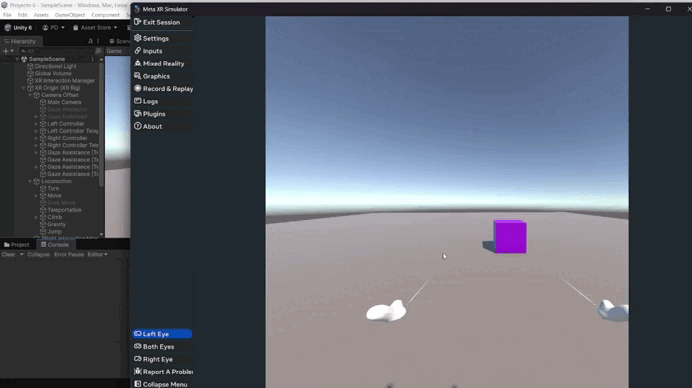

# 🧠 Práctica 6 - XR Interaction Toolkit

Descripción: Realizar toda la configuración del entorno de Unity con las especificaciones para usar Meta XR y las XR Interaction Toolkit. Una vez hecho esto, se pedía el siguiente ejercicio:

> Agrega en la escena dos cubos sobre un plano, uno lejano y otro cercano. El lejano será un Ray Interactor que cambia de color al seleccionarlo. El cercano será un Direct Interactor que muestra un mensaje en consola al agarrarlo.

Han surgido diversos problemas con el simulador, pues este crasheaba según qué acciones hiciesemos cuando la ventana estuviera abierta.

---
