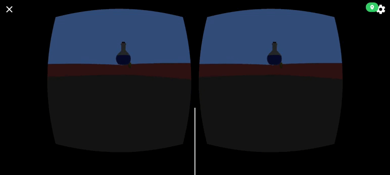

# 📱 Práctica 5 - Escenas Cardboard

En esta práctica se ha configurado un proyecto siguiendo la **[guía](https://developers.google.com/cardboard/develop/unity/quickstart)** adjunta en el campus virtual para poder trabajar en escenas para cardboard en Android.

## 🕶️ Escena desarrollada

Se pedía realizar una escena en la que hubieran diversos items recolectables a lo largo del plano de juego. EL jugador debe recolectar los items con la mirada y al mirar al "almacen", representado como una caja de cartón, los objetos recolectado se irán hasta el almacen (de forma visible). A continuación un pequeño GIF de la escena:  

No conseguí que los objetos se mantuviesen visibles desde la primera vez que lo miras, se ven durante un fps. Sin embargo, como el GIF va a menos fps no se aprecia. Se adjunta el **[apk](./P05.apk)**.