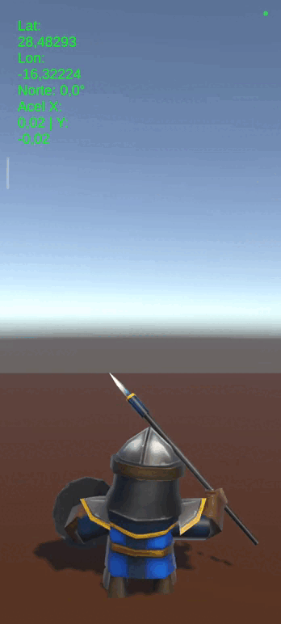
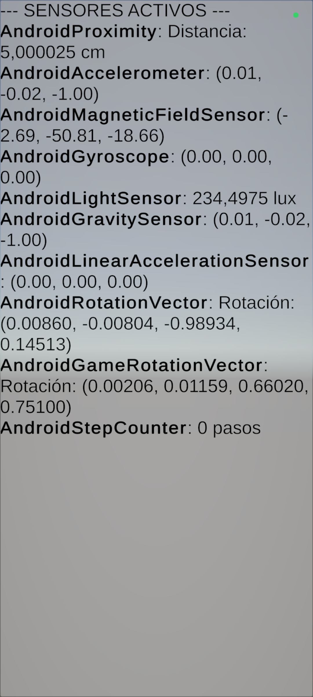

# 📱 Sensores, GPS y Acelerómetro

## 📂 Descripción de Scripts y Escenas

A continuación se detalla la funcionalidad de los scripts implementados para la gestión de sensores móviles y la monitorización de hardware, utilizando el nuevo **Input System** de Unity.

### 1. Escena: Control del Guerrero ⚔️ Compass & GPS
Ejercicio centrado en la orientación y movimiento de un objeto 3D utilizando los sensores físicos del dispositivo móvil.

* **`GuerreroController.cs`**: **Navegación por Acelerómetro y Geolocalización.**
    * **Geofencing (GPS):** Utiliza `Input.location` para obtener la latitud y longitud actual. Define un "área de juego" (centro y radio); si el usuario sale de estas coordenadas, el personaje se detiene (`puedeMoverse = false`).
    * **Brújula (Compass):** Orienta al personaje hacia el **Norte Geográfico** real utilizando `Input.compass.trueHeading`, aplicando una interpolación (`Slerp`) para suavizar el giro y evitar cambios bruscos.
    * **Movimiento por Acelerómetro:**
        * Detecta la inclinación del móvil mediante `Accelerometer.current`.
        * **Mapeo de Ejes:** Asigna la inclinación vertical del móvil (Eje Y) al avance del personaje (Eje Z) y la inclinación lateral (Eje X) al movimiento lateral.
        * **Corrección de Coordenadas:** Invierte el valor del eje Z (`-aceleracion.y`) porque la orientación del sistema de coordenadas corresponde con el punto de vista del dispositivo.
        * **Zona Muerta:** Implementa un umbral (`zonaMuerta`) para evitar movimientos involuntarios cuando el móvil está reposando en una mesa.  

### 2. Escena: Monitor de Sensores 📊
Escena de interfaz de usuario (UI) dedicada a la detección y visualización de todos los sensores disponibles en el hardware del dispositivo.

* **`SensorMonitor.cs`**: **Gestión y Visualización de InputSystem.**
    * **Habilitación Dinámica:** Al inicio, recorre `InputSystem.devices` para detectar periféricos de tipo `Sensor`. Dado que los sensores están deshabilitados por defecto para ahorrar energía, se activan explícitamente mediante `InputSystem.EnableDevice()`
    * **Gestión de Memoria:** Deshabilita los sensores en `OnDisable` para liberar recursos cuando el script no está activo.
    * **Lectura Polimórfica:** Identifica el tipo específico de sensor para formatear correctamente su salida en pantalla:
        * **Movimiento:** Acelerómetro, Giroscopio, Gravedad y Aceleración Lineal (Vectores X, Y, Z).
        * **Ambientales:** Sensor de Luz (Lux) y Campo Magnético (Micro-Teslas).
        * **Usuario:** Contador de pasos (Entero) y Sensor de Proximidad (Distancia en cm).
    * **UI Eficiente:** Utiliza `StringBuilder` para reconstruir el texto de estado en cada frame, optimizando el rendimiento al evitar la creación excesiva de strings.  

